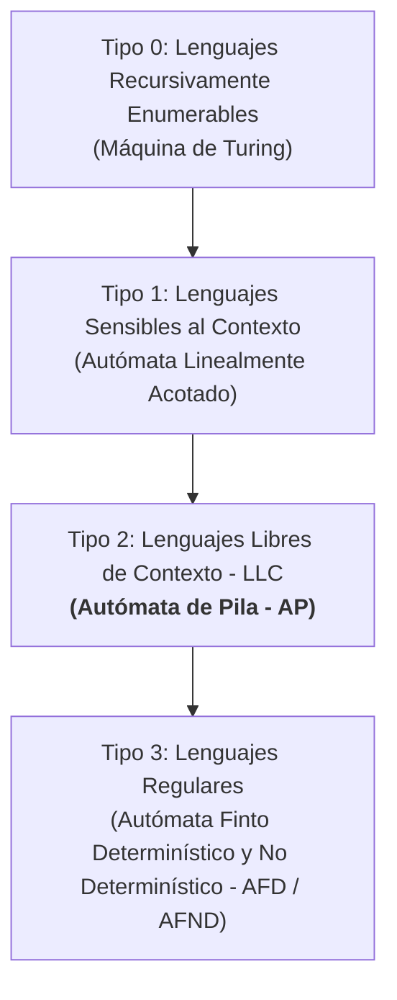

# Actividad 1: Autómatas de Pila (AP / PDA) - Definición, Ejemplos y Utilidades

---

## 1. Introducción y Definición Formal de un Autómata de Pila (AP)

Un **Autómata de Pila** (en inglés, *Pushdown Automaton* o **PDA**) es un modelo de computación teórico que extiende la capacidad de un **Autómata Finito (AF)** mediante la incorporación de una memoria adicional estructurada como una **pila** (estructura LIFO: *Last-In, First-Out* o *Último en entrar, primero en salir*).

Mientras que los Autómatas Finitos Determinísticos (AFD) y No Determinísticos (AFND) poseen una cantidad finita de memoria fijada por su número de estados (lo que los limita a reconocer únicamente **Lenguajes Regulares**), los Autómatas de Pila pueden almacenar teóricamente una cantidad infinita de símbolos en su pila. Esto les confiere la capacidad de recordar dependencias de largo alcance, emparejamientos y conteos, permitiéndoles reconocer **Lenguajes Libres de Contexto (LLC / GLC)** según la **Jerarquía de Chomsky**.

---

### 1.1 Definición Formal (Tupla de 7 elementos)

Un Autómata de Pila $M$ se define formalmente como una tupla de 7 componentes:

$$M = (Q, \Sigma, \Gamma, \delta, q_0, Z_0, F)$$

Donde:
1. **$Q$**: Es un conjunto finito no vacío de **estados**.
2. **$\Sigma$**: Es el **alfabeto de entrada** (conjunto finito de símbolos que pueden leerse de la cadena o programa fuente).
3. **$\Gamma$**: Es el **alfabeto de la pila** (conjunto finito de símbolos que pueden almacenarse en la pila).
4. **$\delta$**: Es la **función de transición**, que determina el comportamiento del autómata:
   $$\delta: Q \times (\Sigma \cup \{\epsilon\}) \times \Gamma \rightarrow \mathcal{P}(Q \times \Gamma^*)$$
   *Explicación operativa:* Dados el estado actual $q \in Q$, el símbolo de entrada leído $a \in \Sigma$ (o la transición espontánea $\epsilon$), y el símbolo en la cima de la pila $X \in \Gamma$, el autómata transita a un nuevo estado $p \in Q$ y reemplaza el símbolo $X$ por una cadena $\gamma \in \Gamma^*$ en la cima de la pila (si $\gamma = \epsilon$, equivale a un *pop* o desapilado; si $|\gamma| > 1$, equivale a un *push* o apilado).
5. **$q_0$**: Es el **estado inicial** ($q_0 \in Q$).
6. **$Z_0$**: Es el **símbolo inicial de la pila** ($Z_0 \in \Gamma$), que se encuentra en el fondo de la pila al comenzar el procesamiento.
7. **$F$**: Es el conjunto de **estados finales o de aceptación** ($F \subseteq Q$).

---

### 1.2 Mecanismos de Aceptación de Cadenas

Un autómata de pila puede aceptar una cadena de entrada de dos formas equivalentes:
1. **Aceptación por Estado Final ($L(M)$)**: El autómata termina de leer toda la cadena de entrada y se encuentra en un estado $q \in F$, independientemente del contenido restante en la pila.
2. **Aceptación por Pila Vacía ($N(M)$)**: El autómata termina de leer toda la cadena de entrada y la pila queda totalmente vacía (incluso desapilando $Z_0$).

> [!NOTE]
> Para los Autómatas de Pila No Determinísticos (APND), ambos criterios de aceptación son equivalentes en cuanto a la clase de lenguajes que reconocen: todo lenguaje aceptado por estado final puede ser transformado en un AP que acepte por pila vacía y viceversa.

---

## 2. Ejemplos Prácticos de Autómatas de Pila

A continuación, se presentan dos ejemplos clásicos y fundamentales de lenguajes que **no pueden** ser reconocidos por un AFD o AFND (por el Lema del Bombeo para lenguajes regulares), pero que se resuelven con elegancia mediante Autómatas de Pila.

---

### Ejemplo 1: Reconocimiento de cadenas del tipo $L_1 = \{a^n b^n \mid n \ge 1\}$

Este lenguaje está compuesto por cadenas que tienen $n$ letras `a` seguidas exactamente por $n$ letras `b` (ejemplos: `ab`, `aabb`, `aaabbb`). Es el modelo básico para validar emparejamientos exactos, como paréntesis de apertura y cierre `()` en lenguajes de programación.

#### Especificación Formal:
* $Q = \{q_0, q_1, q_2\}$
* $\Sigma = \{a, b\}$
* $\Gamma = \{A, Z_0\}$
* $q_0$: Estado inicial de lectura de las letras $a$ (apilado).
* $Z_0$: Símbolo inicial de fondo de pila.
* $F = \{q_2\}$: Estado de aceptación.

#### Función de Transición $\delta$:
1. $\delta(q_0, a, Z_0) = \{(q_0, A Z_0)\}$ *(Al leer la primera `a`, apila `A` sobre $Z_0$)*
2. $\delta(q_0, a, A) = \{(q_0, A A)\}$ *(Por cada `a` adicional, apila otro símbolo `A`)*
3. $\delta(q_0, b, A) = \{(q_1, \epsilon)\}$ *(Al leer la primera `b`, cambia a $q_1$ y desapila una `A`)*
4. $\delta(q_1, b, A) = \{(q_1, \epsilon)\}$ *(Por cada `b` adicional en $q_1$, desapila una `A`)*
5. $\delta(q_1, \epsilon, Z_0) = \{(q_2, Z_0)\}$ *(Si se consumió toda la cadena y la pila muestra el fondo $Z_0$, acepta pasando a $q_2$)*

#### Trazabilidad / Ejecución Paso a Paso con la cadena $w = aabb$:

| Paso | Estado Actual | Símbolo Leído | Contenido de la Pila (Cima a Fondo) | Transición Aplicada / Acción |
| :---: | :---: | :---: | :---: | :--- |
| **1** | $q_0$ | `a` | $Z_0$ | Lee `a`, apila `A`. $\rightarrow (q_0, AZ_0)$ |
| **2** | $q_0$ | `a` | $A Z_0$ | Lee `a`, apila `A`. $\rightarrow (q_0, AAZ_0)$ |
| **3** | $q_0$ | `b` | $A A Z_0$ | Lee `b`, desapila `A`. $\rightarrow (q_1, AZ_0)$ |
| **4** | $q_1$ | `b` | $A Z_0$ | Lee `b`, desapila `A`. $\rightarrow (q_1, Z_0)$ |
| **5** | $q_1$ | $\epsilon$ (fin) | $Z_0$ | Pila con $Z_0$, transición $\epsilon$ a $q_2$. |
| **6** | **$q_2 \in F$** | - | $Z_0$ | **¡Cadena Aceptada!** |

---

### Ejemplo 2: Palíndromos con centro marcado $L_2 = \{w c w^R \mid w \in \{a,b\}^*\}$

En este lenguaje, $w$ es una cadena arbitraria de `a`s y `b`s, $c$ es un símbolo central especial que delimita la mitad de la cadena, y $w^R$ es la cadena $w$ invertida (ejemplos: `aca`, `abcba`, `aab c baa`).

#### Especificación Formal:
* $Q = \{q_0, q_1, q_2\}$
* $\Sigma = \{a, b, c\}$
* $\Gamma = \{A, B, Z_0\}$
* $F = \{q_2\}$

#### Lógica del Autómata:
* **En el estado $q_0$:** Se apilan los símbolos leídos (`a` se apila como `A`, `b` como `B`).
* **Transición con `c`:** Al leer el símbolo central `c`, el autómata transita a $q_1$ sin modificar la pila ($\delta(q_0, c, X) = \{(q_1, X)\}$ para cualquier $X \in \Gamma$).
* **En el estado $q_1$:** Por cada símbolo leído (`a` o `b`), se verifica y desapila el símbolo idéntico en la cima de la pila (`a` desapila `A`, `b` desapila `B`). Si coincide, prosigue; si no coincide, la transición no existe y la cadena es rechazada.
* **Transición final:** Al vaciarse los símbolos de $w$ y encontrar $Z_0$ en la pila con la cadena terminada, transita con $\epsilon$ a $q_2 \in F$.

---

## 3. Conclusión sobre las Utilidades del Autómata de Pila en la Compilación

El estudio y diseño de los Autómatas de Pila no es meramente un ejercicio teórico; constituye el **cruzamiento fundamental entre la teoría de autómatas y la construcción del Analizador Sintáctico (*Parser*) en todo compilador moderno**.

### 3.1 Utilidades y Aplicaciones Clave
1. **Reconocimiento de Estructuras Anidadas y Balanceadas:**
   En cualquier lenguaje de programación formal (C, Python, Rust, Java), existen estructuras recursivas que requieren balanceo exacto:
   * **Bloques delimitados:** `{ ... { ... } ... }`
   * **Expresiones aritméticas con paréntesis:** `((a + b) * (c - d))`
   * **Estructuras de control anidadas:** `if ... then ... else` dentro de otros `if`.
   * Un analizador léxico (*Lexer* / AFD) puede identificar el *token* `{` y el *token* `}`, pero es **incapaz** de garantizar que cada llave abierta tenga una llave cerrada correspondiente y en el orden correcto. El **Autómata de Pila** resuelve esto apilando por cada apertura y desapilando por cada cierre.

2. **Soporte Algorítmico para Parsers LR y LL:**
   * Los analizadores sintácticos automáticos (generados por herramientas como **YACC, Bison o Antlr**) son, en su implementación subyacente, **Autómatas de Pila Determinísticos (DPDA)**.
   * Utilizan la pila para mantener los símbolos gramaticales y los estados de los ítems de la gramática durante los procesos de **desplazamiento (*shift*)** (apilar el token) y **reducción (*reduce*)** (desapilar las partes derecha de una regla de producción y apilar la parte izquierda no terminal).

---

## 4. Importancia Relacionada a su Poder Computacional (Comparación AFD vs. AFND vs. AP)

Para comprender con exactitud la ubicación y supremacía computacional del Autómata de Pila sobre los Autómatas Finitos, debemos enmarcarlos en la **Jerarquía de Chomsky**:

### 4.1 Cuadro Comparativo de Poder Computacional

| Criterio | Autómata Finito (AFD / AFND) | Autómata de Pila Determinístico (DPDA) | Autómata de Pila No Determinístico (APND) |
| :--- | :--- | :--- | :--- |
| **Memoria disponible** | Finito y estático (solo estados de control $Q$). | Infinito (Pila LIFO) + Estados. | Infinito (Pila LIFO) + Estados. |
| **Clase de Lenguaje (Chomsky)** | **Tipo 3: Lenguajes Regulares** | **Subclase de Tipo 2:** Lenguajes Libres de Contexto Determinísticos. | **Tipo 2: Lenguajes Libres de Contexto (GLC)** completos. |
| **Equivalencia Determinismo** | **Equivalentes:** Todo AFND se puede convertir en un AFD equivalente. | **No son equivalentes:** Existen lenguajes que el APND reconoce pero el DPDA no (ej. palíndromos pares $w w^R$). | **Estrictamente más poderoso** que el DPDA. |
| **Capacidad de Conteo / Balanceo** | **Incapaz.** No puede contar $a^n b^n$ porque requeriría infinitos estados. | **Capaz para un solo contador/balanceo** ordenado en espejo o delimitado. | **Capaz de explorar múltiples ramas de balanceo** de forma simultánea. |
| **Fase del Compilador donde se aplica** | **Analizador Léxico (*Lexer* / Tokenizador)** | **Analizador Sintáctico (*Parser* LR/LL)** | Teoría gramatical pura / Parsers generales (GLR/Earley). |

### 4.2 Conclusión Comparativa
* **AFD y AFND:** Son ideales y extremadamente rápidos ($O(n)$) para el **análisis léxico** ya que los tokens individuales (palabras clave, identificadores, números, operadores) no tienen estructuras anidadas complejas ni requieren memoria infinita.
* **Autómatas de Pila (AP):** Superan radicalmente las limitaciones del AFD al incorporar la **memoria en pila**. Esto les permite dominar la **sintaxis de los lenguajes** (GLC/Tipo 2), proporcionando la base matemática indispensable sin la cual no existirían los compiladores ni los lenguajes de programación estructurados tal y como los conocemos.
