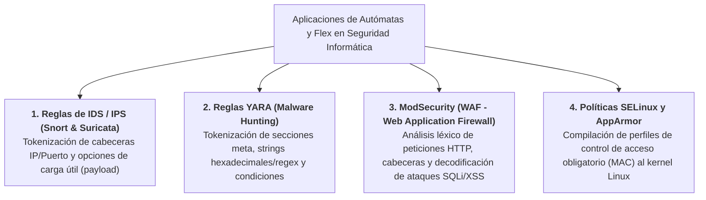

# Actividad 4: Aplicación y Reflexión del Metacompilador `Flex` en el Área de Seguridad Informática

---

## 1. Indagación y Reflexión sobre `Flex` en la Seguridad Informática

En el ámbito de la **Seguridad Informática (Ciberseguridad)**, la rapidez, la eficiencia computacional y la precisión en el análisis de flujos masivos de datos son factores críticos entre detener un ciberataque en tiempo real o sufrir una brecha de seguridad. 

Muchos profesionales asocian los analizadores léxicos (*lexers*) y sintácticos únicamente con la compilación de lenguajes de programación (como C, Java o Rust). Sin embargo, una de las aplicaciones industriales más extensas y poderosas de la **Teoría de Autómatas Finitos Determinísticos (AFD)** y de generadores como **Flex (Fast Lexical Analyzer Generator)** reside en los motores de los sistemas de seguridad informática:

### ¿Por qué Flex es indispensable en motores de Ciberseguridad?
1. **Velocidad de Procesamiento en Tiempo Real ($O(n)$):**
   Los Sistemas de Detección y Prevención de Intrusos (IDS/IPS) como **Snort** o **Suricata** deben inspeccionar millones de paquetes de red por segundo (gigabits por segundo). Si el análisis léxico de las firmas o del tráfico de red se hiciera mediante bucles lentos en lenguajes interpretados o comprobaciones repetitivas de cadenas, el cortafuegos introduciría latencia y causaría pérdida de paquetes. Un autómata generado por Flex lee cada byte exactamente una vez, garantizando una complejidad temporal lineal pura $O(n)$, independientemente de cuántas miles de reglas de seguridad existan en la base de datos.
2. **Tokenización de Firmas y Reglas de Detección:**
   Las herramientas de ciberseguridad utilizan **Lenguajes de Especificación de Reglas** específicos del dominio (*Domain-Specific Languages* o **DSL**) para definir firmas de ataques, patrones de malware e intrusiones de red. Antes de que un motor pueda compilar e inyectar una regla de defensa en la memoria del kernel, requiere un **analizador léxico robusto** construido con Flex (o tecnologías equivalentes) que valide la sintaxis de las reglas, separe las directivas de filtrado y rechace firmas malformadas.

---

## 2. Principales Lenguajes y Formatos en Seguridad donde se Aplica Flex

A continuación, se indaga y presenta en qué lenguajes y arquitecturas de seguridad informática se aplica concretamente la tokenización y el análisis léxico:



---

### 2.1 Reglas YARA (El "Navaja Suiza" de los Analistas de Malware)
**YARA** es el estándar industrial utilizado por analistas de malware y centros de operaciones de seguridad (SOC) para identificar y clasificar especímenes de software malicioso. Una regla YARA es un programa en un lenguaje formal estructurado en tres secciones (`meta`, `strings` y `condition`). El propio proyecto de código abierto YARA (escrito en C) **utiliza internamente Flex y Bison (o autogeneradores AFD similares)** para compilar las reglas de texto antes de escanear archivos binarios o volcados de memoria RAM.

### 2.2 Reglas Snort / Suricata (Detección de Intrusos en Red)
**Snort** es el sistema IDS/IPS de red más utilizado en el mundo. Su motor de reglas es un lenguaje especializado que define la acción (`alert`, `drop`, `log`), el protocolo (`tcp`, `udp`, `icmp`), las direcciones de origen/destino, los puertos, y un bloque de opciones entre paréntesis `(...)` como `msg:"Attack detected"; content:"|00 01 86|"; sid:100001;`. Flex permite tokenizar estas cabeceras a máxima velocidad durante el arranque del motor o recarga en caliente.

---

## 3. Presentación del Lenguaje Seleccionado: Reglas YARA y su Tokenización

Para demostrar concretamente cómo se aplica Flex a la seguridad informática, presentaremos la gramática y tokenización del lenguaje de **Reglas YARA** para detección de troyanos y malware.

### 3.1 Estructura del Lenguaje YARA
Un archivo de reglas YARA presenta la siguiente morfología formal:
```yara
rule Detectar_Malware_Bancario {
    meta:
        author = "UNEG - Seguridad"
        severity = 5
    strings:
        $firma_texto = "cmd.exe /c powershell -enc" ascii wide
        $firma_hex = { E8 ?? ?? ?? ?? 8B 45 08 }
    condition:
        $firma_texto or $firma_hex and filesize < 5MB
}
```

---

### 3.2 Tabla de Tokenización para el Metacompilador Flex

Para construir un lexer en Flex (`yara_lexer.l`) capaz de tokenizar las reglas de ciberseguridad, definimos la siguiente tabla de tokens y patrones:

| Categoría en Seguridad | Token (`Kind`) | Expresión Regular en Flex (`Pattern`) | Descripción / Lexema Real |
| :--- | :--- | :--- | :--- |
| **Palabras Clave de Regla** | `TK_RULE`, `TK_META`, `TK_STRINGS`, `TK_CONDITION` | `rule`, `meta:`, `strings:`, `condition:` | Identifican los bloques estructurales de la firma YARA. |
| **Operadores Lógicos y de Búsqueda** | `TK_OP_OR`, `TK_OP_AND`, `TK_OP_NOT`, `TK_OP_AT`, `TK_OP_IN` | `or`, `and`, `not`, `at`, `in`, `contains` | Operadores condicionales para combinar detecciones. |
| **Modificadores de Cadena** | `TK_MOD_ASCII`, `TK_MOD_WIDE`, `TK_MOD_NOCASE` | `ascii`, `wide`, `nocase`, `fullword` | Indican si la firma busca en UTF-16, ASCII o ignorando mayúsculas. |
| **Identificadores de Regla** | `TK_RULE_IDENTIFIER` | `[a-zA-Z_][a-zA-Z0-9_]*` | Nombres de la regla (ej. `Detectar_Malware_Bancario`). |
| **Identificadores de Cadena (`$`)** | `TK_STRING_VAR` | `\$[a-zA-Z0-9_]+` | Variables que almacenan firmas (ej. `$firma_texto`). |
| **Patrones Hexadecimales (`{ ... }`)** | `TK_HEX_PATTERN` | `\{([0-9a-fA-F? \t\r\n])+\}` | Secuencias de bytes puros en formato hexadecimal o comodines `??`. |
| **Literales de Texto** | `TK_TEXT_STRING` | `\"([^\"\\]|\\.)*\"` | Cadenas de texto que busca la regla dentro del binario sospechoso. |
| **Tamaños de Archivo** | `TK_FILESIZE_UNIT` | `[0-9]+(KB\|MB)` | Unidades de medida para condiciones de tamaño (`filesize < 5MB`). |

---

## 4. Conclusión Reflexiva sobre Seguridad y Lenguajes Formales

El análisis léxico mediante **Flex** es el verdadero pilar oculto de los motores de defensa cibernética. La capacidad de transformar una firma descriptiva escrita por un humano en un autómata determinístico ultrarrápido demuestra que los conceptos matemáticos de lenguajes formales y autómatas finitos impartidos en *Lenguajes y Compiladores* no se limitan a crear software convencional: **son el mecanismo subyacente que protege las infraestructuras críticas, servidores web y redes corporativas en todo el planeta.**
